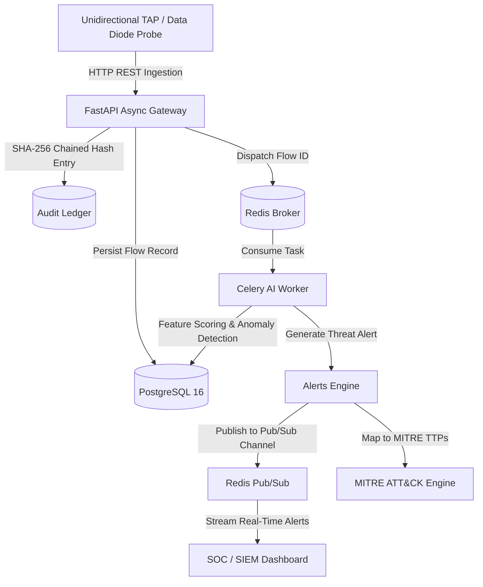

# Cyber Defense Enclave: AI-Based Detection of Cyber Threats in Unidirectional IP Traffic

[](https://fastapi.tiangolo.com)
[](https://www.sqlalchemy.org)
[](https://alembic.sqlalchemy.org)
[](https://docs.celeryq.dev)
[](https://redis.io)
[](https://www.postgresql.org)

Backend infrastructure for **Cyber Defense Enclave: AI-Based Detection of Cyber Threats in Unidirectional IP Traffic**. This system is specifically architected for **unidirectional network environments** (e.g., optical data diodes, unidirectional security gateways, and tap aggregators) where traffic flows strictly from high-security enclaves to lower-security zones without backward acknowledgement or TCP return channels.

---

## 📑 Architecture Overview

In a unidirectional network topology, conventional bidirectional flow metrics (such as forward vs. backward packet ratios, SYN-ACK round trips, and TCP window updates) are unavailable. This backend implements specialized ingestion models, statistical feature extractors, and tamper-evident logging:



### Relational Database Schema Models

1. **`flows`**:
   - Captures unidirectional flow 5-tuples: `src_ip`, `dst_ip`, `src_port`, `dst_port`, `protocol`.
   - Temporal metrics: `start_time`, `end_time`, `duration_ms`.
   - Forward statistical features: `packet_count`, `byte_count`, packet size distribution (`mean`, `std`, `min`, `max`), inter-arrival time (IAT) distribution (`mean`, `std`, `min`, `max`).
   - Shannon payload entropy (`payload_entropy` from 0.0 to 8.0) to identify encrypted, packed, or covert exfiltration tunnels.
   - Extensible JSONB `features` for machine learning feature vectors (burstiness, quantile distributions, TCP header flags).

2. **`alerts`**:
   - Stores threat detections: `id` (UUID), `severity` (LOW, MEDIUM, HIGH, CRITICAL), `severity_score` (0.0 to 10.0), `confidence` (0.0 to 1.0), and `behavior_class`.
   - Foreign keys linking directly to the originating `flow_id` and the matched `mitre_mapping_id`.
   - Explainable AI (XAI) feature payload (`explanation`) showing key indicators that triggered the model.
   - Triage lifecycle state: `NEW`, `INVESTIGATING`, `RESOLVED`, `FALSE_POSITIVE`.

3. **`mitre_mappings`**:
   - Connects alerts to documented adversary behaviors: `tactic_name`, `technique_id` (e.g. `T1046`, `T1048.003`, `T1071.004`), `technique_name`, `subtechnique_id`, `description`, and reference `url`.
   - Pre-seeded with unidirectional attack techniques:
     - **T1048**: *Exfiltration Over Alternative Protocol*
     - **T1048.003**: *Exfiltration Over Unencrypted Non-C2 Protocol*
     - **T1046**: *Network Service Discovery (Unidirectional Port Scan / Sweeps)*
     - **T1071.004**: *Application Layer Protocol: DNS Covert Exfiltration*
     - **T1095**: *Non-Application Layer Protocol (Raw ICMP / UDP Covert Channels)*
     - **T1498**: *Network Denial of Service (High-rate unidirectional floods)*

4. **`audit_logs` (Tamper-Evident Cryptographic Hash Chain)**:
   - Strictly ordered ledger where each entry references the SHA-256 digest of the predecessor.
   - Schema: `sequence_number` (monotonic integer), `timestamp`, `action`, `actor`, `previous_hash`, `record_payload` (canonical JSON), `record_hash`.
   - Genesis record hash: `0000000000000000000000000000000000000000000000000000000000000000` (64 zeros).
   - Any historical alteration, record omission, or unchained injection invalidates all subsequent hashes across the chain, instantly flagged by `POST /api/v1/audit/verify-chain`.

---

## 📂 Project Directory Layout

```
cyber-project/
├── docker-compose.yml           # PostgreSQL, Redis, FastAPI & Celery Worker
├── Dockerfile                   # Python 3.11 container image
├── pyproject.toml               # Modern Python project configuration
├── requirements.txt             # Locked dependencies
├── .env.example                 # Environment configuration template
├── alembic.ini                  # Alembic migration configuration
├── alembic/
│   ├── env.py                   # Async/Sync migration runner
│   ├── script.py.mako           # Migration template
│   └── versions/
│       └── 0001_initial_schema.py # Initial migration covering all 4 tables
└── app/
    ├── main.py                  # FastAPI application entrypoint & lifespan
    ├── api/                     # API routers and versioning
    │   └── v1/
    │       ├── router.py        # Root v1 aggregator
    │       └── endpoints/
    │           ├── health.py    # Health & readiness probes (DB + Redis)
    │           ├── flows.py     # Unidirectional flow ingestion (single/batch)
    │           ├── alerts.py    # Alert querying & triage update
    │           ├── mitre.py     # MITRE ATT&CK mappings & seeding
    │           └── audit.py     # Audit ledger & cryptographic verification
    ├── core/                    # Engine configurations
    │   ├── config.py            # Pydantic Settings
    │   ├── database.py          # Async & Sync SQLAlchemy 2.0 sessions
    │   ├── celery_app.py        # Celery application & worker configuration
    │   └── redis.py             # Async Redis pool & Pub/Sub publisher
    ├── models/                  # SQLAlchemy Declarative Models
    │   ├── base.py              # Base and TimestampMixin
    │   ├── flow.py              # 'flows' table
    │   ├── alert.py             # 'alerts' table
    │   ├── mitre.py             # 'mitre_mappings' table
    │   └── audit.py             # 'audit_logs' tamper-evident table
    ├── schemas/                 # Pydantic validation & serialization DTOs
    │   ├── flow.py
    │   ├── alert.py
    │   ├── mitre.py
    │   └── audit.py
    ├── ml/                      # Hybrid Machine Learning Threat Detection Engine
    │   ├── feature_vector.py    # 12-dimensional feature vector extraction & normalization
    │   ├── unsupervised.py      # Isolation Forest zero-day anomaly detector
    │   ├── supervised.py        # Random Forest signature-style threat classifier
    │   ├── ensemble.py          # Unified ensemble risk scoring & zero-day escalation
    │   ├── severity_matrix.py   # Multi-factor matrix (confidence * impact * asset criticality)
    │   ├── explainer.py         # SHAP / Tree local feature attribution helper
    │   ├── trainer.py           # Training pipeline & model artifact persistence
    │   └── saved_models/        # Serialized model binaries (.joblib)
    ├── services/                # Domain business logic
    │   ├── packet_extractor.py  # 6-routine unidirectional feature engine & EWMA
    │   ├── pcap_service.py      # dpkt raw byte packet reader & flow aggregator
    │   ├── audit_service.py     # Hash-chain creation & integrity validation
    │   ├── flow_service.py      # Ingestion & Shannon entropy calculations
    │   ├── alert_service.py     # Alert creation, updates & Pub/Sub broadcasting
    │   └── mitre_service.py     # MITRE seeding & lookup
    └── workers/                 # Background execution
        └── tasks.py             # Asynchronous threat scoring & audit audits
├── scripts/
│   └── pcap_replay.py           # Synthetic multi-threat PCAP generator & asyncio replay
└── tests/
    ├── test_feature_extractor.py # Pytest test suite for 6 feature extraction routines
    └── test_ml_engine.py        # Pytest test suite for hybrid ML detection engine


```

---

## 🚀 Quick Start (Docker Compose)

The easiest way to boot the complete environment (PostgreSQL 16, Redis 7, FastAPI application, and Celery worker) is using Docker Compose:

```bash
# 1. Clone or navigate to the directory
cd cyber-project

# 2. Copy the example environment file
cp .env.example .env

# 3. Spin up all services
docker compose up --build
```

Services will start:
- **FastAPI Application**: `http://localhost:8000`
- **Interactive Swagger UI**: `http://localhost:8000/docs`
- **ReDoc Documentation**: `http://localhost:8000/redoc`
- **PostgreSQL Database**: `localhost:5432` (`cyber_defense_db`)
- **Redis Cache & Broker**: `localhost:6379`

---

## 🛠️ Local Development Setup (Without Docker)

### 1. Create Virtual Environment
```bash
python3 -m venv .venv
source .venv/bin/activate
pip install -r requirements.txt
```

### 2. Environment Variables
```bash
cp .env.example .env
# Adjust DATABASE_URL and REDIS_URL in .env if needed
```

### 3. Apply Database Migrations
```bash
alembic upgrade head
```

### 4. Seed Default MITRE ATT&CK Mappings
Run the FastAPI app and trigger the seed endpoint:
```bash
curl -X POST http://localhost:8000/api/v1/mitre/seed
```

### 5. Start FastAPI Development Server
```bash
uvicorn app.main:app --reload --host 0.0.0.0 --port 8000
```

### 6. Start Celery Worker
```bash
celery -A app.core.celery_app.celery_app worker --loglevel=info
```

---

## 📡 API Reference Summary

| Method | Endpoint | Description |
|---|---|---|
| `GET` | `/api/v1/health` | Service liveness probe |
| `GET` | `/api/v1/health/ready` | Service readiness probe (validates DB & Redis) |
| `POST` | `/api/v1/flows/ingest` | Ingest a single unidirectional flow |
| `POST` | `/api/v1/flows/ingest/batch` | High-throughput batch flow ingestion |
| `POST` | `/api/v1/flows/ingest/pcap` | Upload raw PCAP for line-rate dpkt extraction |
| `GET` | `/api/v1/flows` | Query & filter flows (IP, port, entropy) |
| `GET` | `/api/v1/flows/{flow_id}` | Retrieve flow details and linked alerts |
| `GET` | `/api/v1/alerts` | Query threat alerts (severity, class, status) |
| `POST` | `/api/v1/alerts` | Explicitly submit a threat alert |
| `POST` | `/api/v1/alerts/evaluate-flow` | Real-time ML ensemble evaluation & SHAP XAI |
| `PATCH` | `/api/v1/alerts/{alert_id}` | Update alert status (`NEW`, `RESOLVED`, etc.) |
| `GET` | `/api/v1/mitre` | List MITRE ATT&CK techniques |
| `POST` | `/api/v1/mitre/seed` | Seed default unidirectional techniques |
| `GET` | `/api/v1/mitre/{technique_id}`| Lookup technique (e.g. `T1048`) |
| `GET` | `/api/v1/audit` | Chronological audit ledger inspection |
| `POST` | `/api/v1/audit/verify-chain` | Verify cryptographic SHA-256 hash continuity |

---

## 🤖 Hybrid Machine Learning Detection Architecture

The ML detection engine pairs unsupervised anomaly isolation with supervised attack classification to protect unidirectional network taps:

1. **Unsupervised Isolation Forest**:
   - Isolates zero-day behaviors and novel tunneling techniques in a 12-dimensional feature space without needing pre-labeled ground truth.
   - Outputs normalized anomaly score $S_{\text{unsup}} \in [0.0, 1.0]$.
2. **Supervised Random Forest Classifier**:
   - Classifies flows into discrete signature threat classes: `PORT_SCAN`, `DATA_EXFILTRATION`, `DOS_BURST`, `C2_BEACON`, `DEVICE_SPOOF`, `BENIGN`.
   - Produces probability distribution and confidence score $C_{\text{sup}} \in [0.0, 1.0]$.
3. **Ensemble Risk Fusion & Zero-Day Escalation**:
   - Fuses unsupervised and supervised scores:
     - Known threat match: $\text{Risk} = 0.65 \times C_{\text{sup}} + 0.35 \times S_{\text{unsup}}$.
     - Supervised sees `BENIGN` but Isolation Forest flags anomaly ($S_{\text{unsup}} \ge 0.65$): **Escalated as `NOVEL_ANOMALY` (Zero-Day Suspect)** with unified risk $= S_{\text{unsup}}$.
4. **Multi-Factor Severity Scoring Matrix**:
   - Combines model confidence, threat impact weight, and destination/source asset criticality ($1.0 \times$ to $2.0 \times$ for SCADA/data diode enclaves):
     $$\text{Score} = \min(10.0, 10.0 \times C \times I \times A)$$
   - Maps to `LOW`, `MEDIUM`, `HIGH`, or `CRITICAL`.
5. **SHAP TreeExplainer Local Attribution**:
   - Extracts exact Shapley values $\phi_i(x)$ for each flagged alert, identifying the top driving features (e.g. `payload_entropy`, `iat_entropy`, `packet_size_skew`) that triggered the detection.


---

## 🎯 Synthetic PCAP Replay & Unidirectional Feature Extraction

The repository includes a simulation and replay engine [`scripts/pcap_replay.py`](file:///Users/adityabanavali/Downloads/cyber-project/scripts/pcap_replay.py) that synthesizes realistic data diode threat streams:
- **Benign Background**: Dynamic packet sizes & IATs, modest entropy, stable TTL.
- **C2 Beaconing**: Strict 1.0s periodic pulses with low jitter $\rightarrow$ near-zero IAT Shannon entropy.
- **Covert Exfiltration**: High-entropy ciphertext (> 7.5 entropy), continuous large frame transmission.
- **Port Sweeps**: Single-packet SYN probes directed at sensitive port ranges without handshakes.
- **TTL Spoofing**: Multi-TTL variance from identical source IPs.

### Replay Commands
```bash
# Replay synthetic multi-threat stream at controlled rate (e.g., 200 packets/sec)
python scripts/pcap_replay.py --rate 200

# Generate and persist synthetic PCAP file to disk
python scripts/pcap_replay.py --save-pcap sample_threats.pcap

# Replay an existing PCAP file and feed directly into the FastAPI ingestion endpoint
python scripts/pcap_replay.py --input-pcap sample_threats.pcap --api-url http://localhost:8000/api/v1 --rate 100
```


---

## 🔒 Cryptographic Tamper-Evident Hash Chaining

The audit system guarantees non-repudiation and detects unauthorized database tampering. For every event:
1. The preceding record's `record_hash` is retrieved as `previous_hash`.
2. A deterministic canonical JSON string is produced for `record_payload`.
3. The cryptographic SHA-256 hash is computed:
   $$\text{Hash}_i = \text{SHA256}(\text{seq}_i \parallel \text{timestamp}_i \parallel \text{action}_i \parallel \text{actor}_i \parallel \text{Hash}_{i-1} \parallel \text{canonical}(\text{payload}_i))$$
4. Calling `POST /api/v1/audit/verify-chain` recalculates every link in $O(N)$ time. If an attacker directly alters a record in the database, the hash of that record and all downstream links will immediately fail verification.
# Avex_Defense
